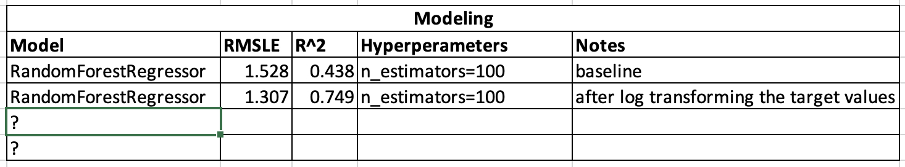

# Can We Accurately Predict Energy Usage?

        
    

 

## Background and Motivation
Reducing energy consumption, and thus CO2 emissions, is key to lessoning the worst impacts of climate change. According to recent data from the U.S. Energy Information Administration building energy usage between residential, commercial, and industrial sectors accounts for 71% of all energy
usage. In Many utility companies offer incentives to spur their customers to adopt energy efficiency upgrades. What incentives are offered depends on the predicted energy saving achieved and without an accurate baseline usage it’s impossible to accurately predict savings. I am using usage data from over 1,400 commercial and industrial buildings to create a model to predict future usage.

## Data
The data I used for this project was from a Kaggle competition, but it was actually provided by the American Society of Heating, Refrigerating and Air-Conditioning Engineers (ASHRAE) and their partners. The goal of this competition is to predict energy usage of 1,448 commercial and industrial buildings. The dataset consisted of six different CSV files. Three of the csv files were to be used for your train and validation. The other three were test files which do not contain the target value. Once your model has made a prediction you upload those predictions to kaggle for them to be scored using root mean squared logarithmic error (rmsle).

        
    

 

Primary uses included Education, Entertainment/public assembly, Food sales and service, Healthcare, Lodging/residential, Manufacturing/industrial, Office, Other, Parking, Public services, Retail, Services, Technology/science, Utility, and Warehouse/storage.

## Insert pie chart of uses here

One of the first concerns I had when looking at this csv was that both year_built and floor_count were missing data for more than 50% of the buildings. Floor_count was the most dissapointing because the height of a building, as well as the difference in temperature inside and outside, directly impacts heated air loss and thus energy usage.

        
    

 

This csv file had over 20 million rows of data.

        
    

 

Of note in this csv is every column, but site_id and timestamp were missing values.

        
    

 

As a final note before cleaning, the description of this dataset stated that there was three years worth of usage data. I initially thought that meant I would have it least two years worth of data to both train and validate on prior having to submit predictions to Kaggle. As I dug deaper into the data i discovered that I only had one years worth of training data which meant I'd have to creativly engineer date time or submit predictions to Kaggle each time in order to know how my model was performing. I'll go over how I overcame that in data cleaning.

## Data Cleaning
After merging all three dataframes together i first converted 

I needed to decide which of the columns missing data would I drop and which would I attempt to impute. Year_built and floor_count were obvious choices for dropping, because so much of the data was misisng. Most of the weather related columns were missing values, but luckily air_temperature was missing the fewest. With it being what I believed to be the most important predictor I decided to try imputing the missing values. I decided to drop the rest of the weather data at this point for simplicity, but plan to consider imputing it in the future.

When viewing air_temperatures in the weather csv by itself it only appeared 55 values were missing. However, when I combined the dataframes I ended up with over 90,000 missing air_temperatures. I later determined this was due to a large number of mssing rows in the weather cvs. In order to inpute the missing temps I first created a lookup table with the mean temps for each day at each of the 16 sites. I then created a function to iterate through my merged dataframe and when it found Nan's it used the site it and date to find and replace the Nan with the correct mean value. Creating this function to work on a small subset of my data proved to be a challenge, especially when my lookup table had a multiIndex. However, the much larger challenge came when I tried to use it on my full dataset. After running it twice, using time.time the second time, and trying to write an optomized function while it was running the second time it took almost 7 hours. 

## EDA
## Modeling Using Random Forest

        
    

 

        
    

 

## Conclusions
## Goals for Capstone 3
* 