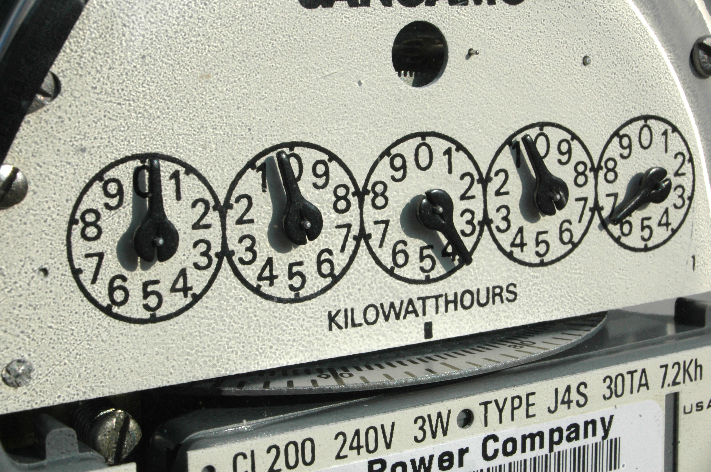
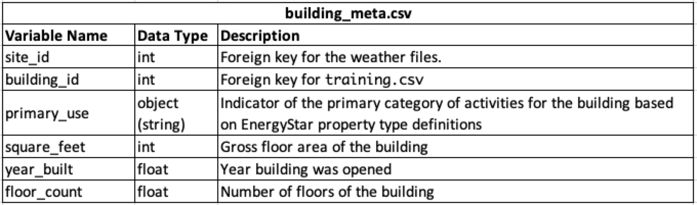
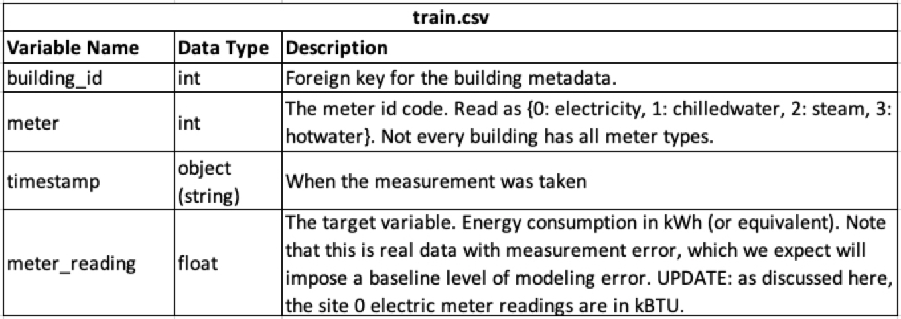
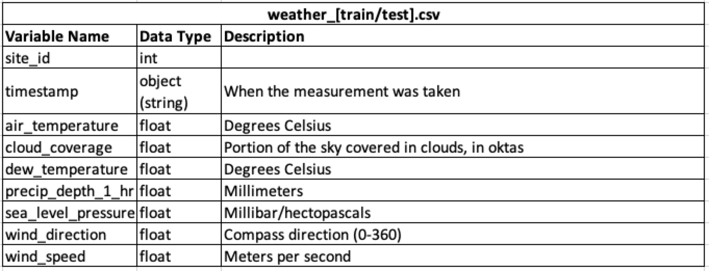
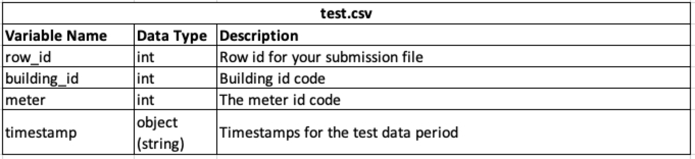
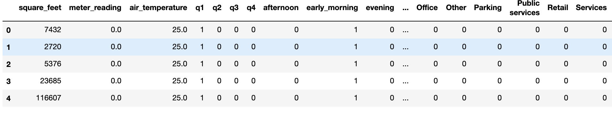
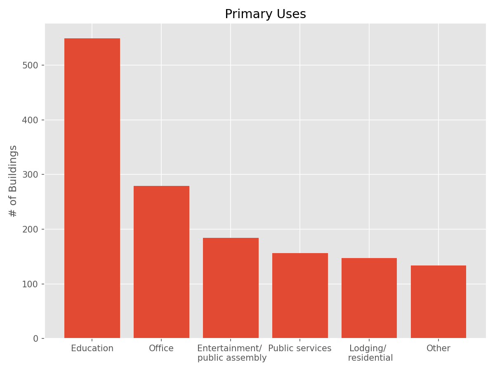

# Can We Accurately Model Building Energy Usage?

        
    

 

## Background and Motivation
I have spent almost half of my career in the energy efficiency industry. It's been a passion of mine since late in high school. What drove me to energy efficiency was an appreciation for the natural environment instilled in my as a child, a realization of detrimental impacts global climate change, and 
the huge impact reducing energy consumption can have.

Reducing energy consumption, and thus CO2 emissions, is key to lessoning the worst impacts of climate change. According to recent data from the U.S. Energy Information Administration building energy usage between residential, commercial, and industrial sectors accounts for 71% of all energy usage. Many utility companies offer incentives to spur their customers to adopt energy efficiency upgrades. What incentives are offered depends on the predicted energy saving achieved and without an accurate baseline usage it’s impossible to accurately predict savings. For this project I'll be using past energy usage, and weather data, from over 1,400 commercial and industrial buildings to create a model that allows me to predict future energy usage.

## Data
The data I used for this project was from a Kaggle competition hosted by the American Society of Heating, Refrigerating and Air-Conditioning Engineers (ASHRAE). You can find a link to the competition site <a href="https://www.kaggle.com/c/ashrae-energy-prediction/overview">here</a>. The dataset consisted of five different CSV files as well template for submission of my predictions. The first three csv files are for training and validation. The data contained in them is from 2016. The last two are for testing and include similar information for 2017 through mid 2018. The target is not included with the test files so in order to get a score you must submit your predictions to Kaggle. Your predictions are scored using root mean squared logarithmic error (rmsle). Below is a look at the types of data contained within each csv.

        
    

 

Primary uses included Education, Entertainment/public assembly, Food sales and service, Healthcare, Lodging/residential, Manufacturing/industrial, Office, Other, Parking, Public services, Retail, Services, Technology/science, Utility, and Warehouse/storage.

One of the first concerns I had when looking at this csv was that both year_built and floor_count were missing data for more than 50% of the buildings. Floor_count was the most disappointing because the height of a building, as well as the difference in temperature inside and outside, directly impacts heated air loss and thus energy usage.

        
    

 

This csv file had over 20 million rows of data.

        
    

 

Of note in this csv is every column, but site_id and timestamp were missing values.

        
    

 

As a final note before cleaning, the description of this dataset stated that there was three years worth of usage data. I initially thought that meant I would have at least two years worth of data to both train and validate on prior having to submit predictions to Kaggle. As I dug deeper into the data I discovered that I only had one years worth of training data which meant I'd have to creativly engineer the timestamps or submit predictions to Kaggle each time in order to know how my model was performing. I'll go over how I overcame that in data cleaning. The other 1.5 years worth of data is in the test set and is 40 million rows.

## Data Cleaning
After merging all three training data frames together I began working on cleaning.

I first worked to get the timestamps into a format that would allow me to split the years worth of data in train and test while retaining some of the cyclical properties. To do this I converted the timestamps to datetime format and then split out the date and time into their own columns. Afterword’s I used masking to replace each date with q1, q2, q3, or q4. I then did the same thing with time, but replaced them with early morning, morning, afternoon, and evening. Lastly, I used one-hot encoding to convert these categorical values to numerical.

After reformatting the timestamp I used one-hot encoding on the primary_usage and meter columns.

Next, I needed to create a function to convert the meter_readings in site 0 to kWh for usage in the model and then back to kBtu for submittal to Kaggle.

The last step in my data cleaning was deciding which of the columns with missing data I would drop and which would I attempt to impute. Year_built and floor_count were obvious choices for dropping, because so much of the data was missing. Most of the weather related columns were missing values, but luckily air_temperature was missing the fewest. With it being what I believed to be the most important predictor I decided to try imputing the missing values. At least initially I dropped the rest of the weather data, but plan to consider imputing it in the future.

When viewing air_temperature in the weather csv by itself it only appeared 55 values were missing. However, when I combined the data frames I ended up with over 90,000 missing air_temperatures. I later determined this was due to a large number of missing rows in the weather cvs. In order to impute the missing temps I first created a lookup table with the mean temps for each day at each of the 16 sites. I then created a function to iterate through my merged data frame and when it found Nan's it used the site it and date to find and replace the Nan with the correct mean value. Creating this function to work on a small subset of my data proved to be a challenge, especially with my lookup table having a multiIndex. This is something I had not yet encountered. However, the much larger challenge came when I tried to use it on my full dataset. After running it twice, using time.time the second time, and trying to write an optimized function while it was running the second time it took almost 7 hours to finish this step. Below is what the cleaned data looks like.

        
    

 

## EDA

        
    

 

Due to significant amount of time it took to get my data into a form I could put into a model I choose to skip additional EDA and start modeling.

## Modeling Using Random Forest
My initial goal with this project was to be able to get one working model, preferably with my entire data set. I did initially try that, but after leaving my model running overnight again I woke up to an error message that the process had been killed.

In the interest of time I decided to use a smaller subset of my data. Specifically I used all data with a meter type of hot water. After running a basic RandomForestRegressor with multiple different numbers of trees (n_estimators) I settled on 100 and got the below baseline. 

        
    

 

As one final step I ran my target column, meter_reading, through a logarithmic transformation. I then ran the same model again and saw a large improvement in both my R^2 and RMSE. As a comparison the RMSLE of the individual who won this competition was 1.231.

        
    

 

From that final model the below graph is of the feature importance’s of the top 5 features.

        
    

 

## Conclusions
Modeling the amount of data present in both my test () and train () dataset is difficult. 
From my inital modeling it appears I should be able to predict savings, but I won't have a better idea of it's predictive capabilities until I am able to rund the model on a full dataset.

## Future Direction
* Utilize AWS for future cleaning and modeling
* Look into tuning hyperparameters for this model and using other models
* Create more plots to look at the relationships between the meter types and features to discover trends or more useful features 
* Look into imputing the missing values from one or more of the dropped columns in the weather data
* Separately model data from the other three meter types to compare which features are most significant to each meter type. Also, determine if it's best to have one model for all four types on one model for each type.
* Run a model on the entire test data set and submit predictions to Kaggle for scoring

## Sources
* Data - https://www.kaggle.com/c/ashrae-energy-prediction/leaderboard
* Energy stats - https://www.eia.gov/
* Biden admins climate goals - https://www.nytimes.com/live/2021/04/22/us/biden-earth-day-climate-summit

