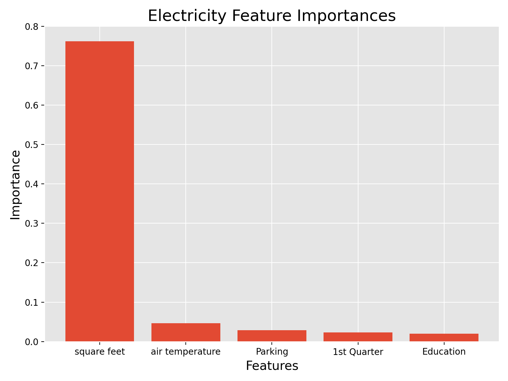

# Can We Accurately Model Building Energy Usage? (Being Edited)

        
    

 

## Background and Motivation
I have spent almost half of my career in the energy efficiency industry. It's been a passion of mine since late in high school. What drove me to energy efficiency was an appreciation for the natural environment instilled in my as a child, a realization of detrimental impacts global climate change, and the huge impact reducing energy consumption can have.

Reducing energy consumption, and thus CO2 emissions, is key to lessoning the worst impacts of climate change. According to recent data from the U.S. Energy Information Administration building energy usage between residential, commercial, and industrial sectors accounts for 71% of all energy usage. Most utility companies offer financial incentives for their customers to reduce energy consumption in the form of rebates for certain energy efficiency upgrades. In the case of commercial and industrial this can be in the form of a cash rebate tied directly to how much energy is saved. In order to accuratly calculatye how much energy was save with any particular upgrade you need to know how much energy would have been used had that upgrade not been installed, a baseline usage. For this project I used past energy usage data for over 1,400 commercial and industrial buildings and weather data from 16 different sites to determine if I could model this baseline energy usage.

## Data
The data I used for this project was from a Kaggle competition hosted by the American Society of Heating, Refrigerating and Air-Conditioning Engineers (ASHRAE). You can find a link to the competition site <a href="https://www.kaggle.com/c/ashrae-energy-prediction/overview">here</a>. The dataset consisted of five different csv files as well as a template for submitting predictions to Kaggle for scoring. 

### Metadata
The building metadata file had one row for each of the 1448 builidngs with the below information:

| Feature Name  | Data Type  |  Description |
|---|---|---|
|  site_id | int  | Primary key for each of 16 sites that each building was located at  |
|  building_id | int  | Primary key for each building  |
|  primary_use | object(string)  | Indicator of the primary category of activities for the building based on EnergyStar property type definitions  |
|  square_feet | int  | Gross floor area of the building  |
| year_built | float  | Year building was opened  |
|  floor_count  | float  | Number of floors  |

Primary uses included Education, Entertainment/public assembly, Food sales and service, Healthcare, Lodging/residential, Manufacturing/industrial, Office, Other, Parking, Public services, Retail, Services, Technology/science, Utility, and Warehouse/storage.

### Training Data
The training data file consisted of 20 million rows of hour by hour energy consumption readings for each builiding and each of it's metered energy types for 2016.

| Feature Name  | Data Type  |  Description |
|---|---|---|
|  building_id | int  | Foreign key for the metadata.  |
|  meter | int  | The meter id code. Read as {0: electricity, 1: chilledwater, 2: steam, 3: hotwater}. Not every building has all meter types.  |
|  timestamp | object(string)  | When the reading was taken  |
|  meter_reading | float  | The target variable. Energy consumption in kWh (or equivalent). Note that this is real data with measurement error, which we expect will impose a baseline level of modeling error. UPDATE: as discussed here, the site 0 electric meter readings are in kBTU.

### Weather Data
The weather data file consisted of 140,000 rows of hour by hour energy consumption readings for each of the 16 sites for 2016.

| Feature Name  | Data Type  |  Description |
|---|---|---|
|  site_id | int  | Foreign key for the metadata.  |
|  timestamp | object(string)  | When the reading was taken  |
|  air_temperature | float  | Degrees celsius  |
|  cloud_coverage | float  | Portion of the sky covered in clouds, in oktas  |
|  dew_temperature  |  float  |  Degrees celsius  |
|  precip_depth_1_hr  |  float  |  Millimeters  |
|  sea_level_pressure  |  float  |  Millibar/hectopascals  |
|  wind_direction  |  float  |  Compass direction (0-360)  |
|  wind_speed  |  float  |  Maters persecond  |

### Test Meter Reading and Weather Data
The remaining two files mirrored the training and weather data files accept meter reading, the target value, was missing, the data spanned 2017 and half of 2018, and it was over 40 million rows of data.

## Data Cleaning and EDA
Due to the very large size of both the training and test datasets, and my limited time, I choose to use just the training data initially. This would require require me to alter the time stamp column in such a way that would keep the cyclycal properties while allowing me to randomly split the data into a train and holdout set for validation.

After merging all three training data frames together I first took a look how many missing or null values I had.

        
    

 

Of the 16 features I had floor count, year built, cloud coverage, percipitation depth each hour, wind direction, and sea level pressure were all missing a large number values. The most dissapointing being floor count because the height of a building, as well as the difference in temperature inside and outside, directly impacts heated air loss and thus energy usage. Wind speed, dew temperature, and air temperature where also missing missing values though not nearly as many. At least initally I choose to drop all columns with missing values with the exception air temperature, which I believed to be one of the most important feature. 

In the case of air temperature I choose to impute the missing values. In order to do so I first created a lookup table, from the weather data file, with the mean temperatures for each day at each of the 16 sites. I then created a function to iterate through my merged data frame and when it found Nan's it used the site id and date to sear the lookup table and replace the Nan with the correct mean value. Creating this function to work on a small subset of my data proved to be a challenge, especially with my lookup table having a multiIndex. This is something I had not yet encountered. However, the much larger challenge came when I tried to use it on my full dataset. After running it twice, using time.time the second time, and trying to write an optimized function while it was running the second time it took almost 7 hours to finish this step. Below is what the cleaned data looks like.

 Next, I converted the timestamps to datetime format and then split out the date and time into their own columns. Afterword’s I used masking to replace each date with 1st Quarter, 2nd Quarter,3rd Quarter, or 4th Quarter. I then did the same thing with time, but replaced them with early morning, morning, afternoon, and evening. Lastly, I used one-hot encoding to convert these categorical values to numerical. This would allow me to split the data into a train and holdout set for validation.

After reformatting the timestamp I used one-hot encoding on the primary_usage and meter columns. I also took a look at the number of buildings with each primary use type and percentage of meter readings by metered energy type.

        
    

 

With respect to primary use types interestingly Education made up the majority of the buildings in this dataset.

        
    

 

With respect to metered energy type electricity made up more up more than 60 percent of the metered energy readings.

Lastly, created a function to convert the meter_readings in site 0 to kWh for usage in the model and then back to kBtu for submittal to Kaggle.

## Modeling Using Random Forest
As a baseline model I choose the random forest regressor because of it's simplicity and accuracy with minimal hyperperameter tuning. I also chose to use Root Mean Squared Log Error (RMSLE) as my error metric because it doesn't allow large differences in the target values to skew the error value making for easier comparison. While doing EDA I noted that usage values for hot water were siginificantly higher than those for the other three metered energy types.

I initially decided to model each of the metered energy types individually thinking that may make for more accurate modeling. After modeling them this way though I realized there was a stark difference between the most important features for electricity and the other three metered energy types. 

        
    

 

For electiricity square footage was the most important feature over all other features.

        
    

 

For the other three however air temperature was also very important.

After remodeling these two subsets, trying multiple hyper perameter combinations, and then recombining the scores I got an RMSLE of **0.855**. This is in comparison to the winning RMSLE in the Kaggle compitition of **0.931**.

## Conclusions
With the minimal amount of time I had available for this project I was able to create model that predicts pretty well with an RMSLSE of 0.855 as compared to the winngin RMSLE of 0.931. However, my model was only used on the training data whereas to be an accurate comparison I will need to run my model on the test data, That's something I'd like to do in the future.

By utilizing AWS EC2 I was able to decrease processing time of my cleaning script from over 6.5 hours to just over 2 hours

Modeling the amount of data present in both my test () and train () dataset is difficult. 
From my inital modeling it appears I should be able to predict savings, but I won't have a better idea of it's predictive capabilities until I am able to rund the model on a full dataset.

## Future Direction
* Utilize AWS for future cleaning and modeling
* Look into tuning hyperparameters for this model and using other models
* Create more plots to look at the relationships between the meter types and features to discover trends or more useful features 
* Look into imputing the missing values from one or more of the dropped columns in the weather data
* Separately model data from the other three meter types to compare which features are most significant to each meter type. Also, determine if it's best to have one model for all four types on one model for each type.
* Run a model on the entire test data set and submit predictions to Kaggle for scoring

## Sources
* Data - https://www.kaggle.com/c/ashrae-energy-prediction/leaderboard
* Energy stats - https://www.eia.gov/
* Biden admins climate goals - https://www.nytimes.com/live/2021/04/22/us/biden-earth-day-climate-summit

